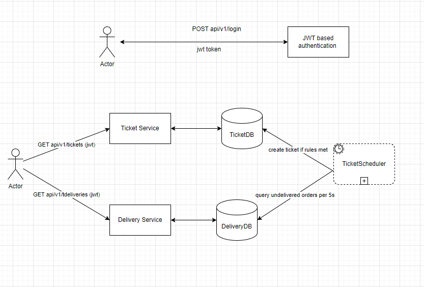
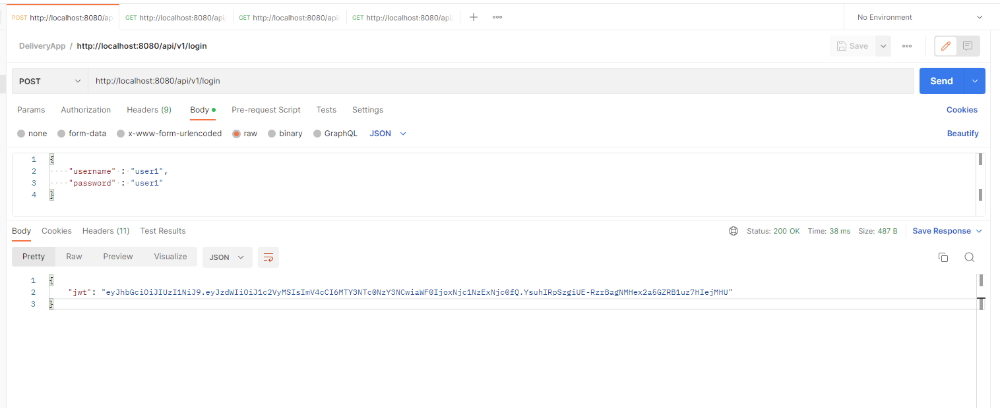
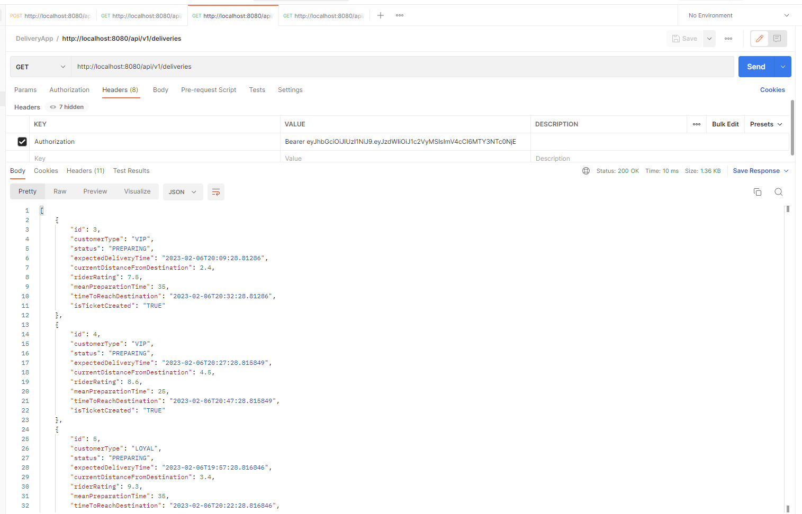
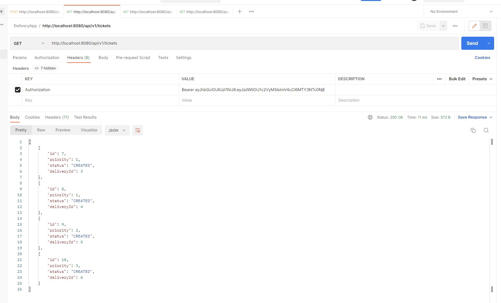
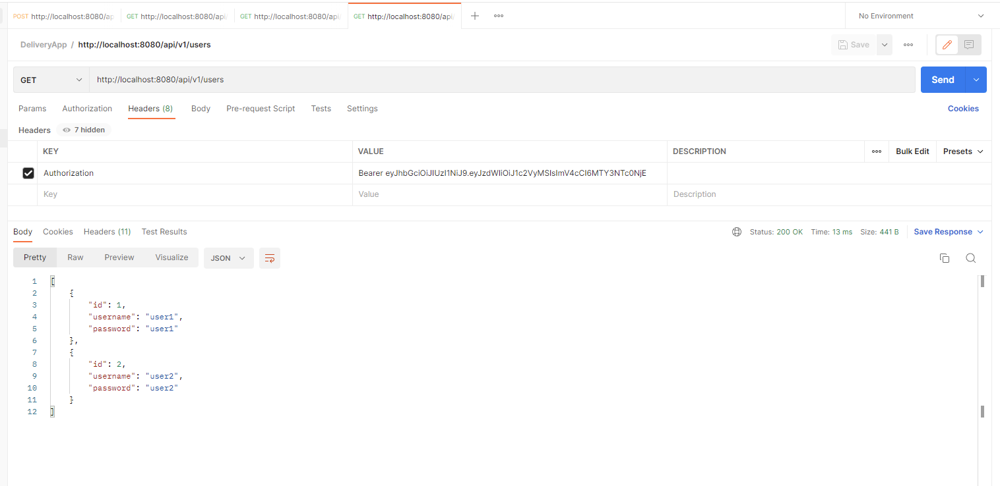

# ticketing-service

# Spring Boot Project for Automated Ticketing Service

## Business Requirements :

Create an “Automated Ticketing System” which will go scan the system and create the tickets so hired agent will be able to resolve the ticket even before the customer reports. This will help the company to improve the customer experience. They are facing so many complaints so they have to increase the people in their Customer Support department.

The system will monitor the deliveries with a regular interval time and create the ticket, calculate the priority of each ticket by taking into consideration the delivery details.

## Project Specifications :
This is a Spring Boot application and we have implemented a web service that has endpoints to authenticate the user, fetch deliveries, tickets and users. The system consists of a Ticketing Scheduler which periodically runs after every 5 secons and monitors current delivery orders against preloaded rules and automatically creates a ticket if any of the rule is met.

### Security :

The system user JWT (Json Web Token) based authentication which means that user must first enter his/her credentials and procure a JWT token on successful authentication which would be used in subsequent requests. The jwt token is to be passed in the Authorization header as "Bearer <jwt token>" in the subsequent requests.


## System Design:

### Architecture Diagram:




Ticketing Service is microservice based on layered architecture and is a RESTful Web Service. This service can be deployed independently on premise or on cloud and can also be containerized to execute as docker containers. There are 4 layers from top to bottom:

## API Layer:
Top layer, which is main interface available for integration and interaction with front-end or end user to consume APIs.

## Service Layer
This layer sits in between API layer and Data access layer with some utility functionality and business logic.
It's mainly responsible for interacting with Data Access Layer and transferring the tickets, deliveries data as required by top and below layers.
It's just another module added to decouple business logic of tickets, deliveries data transfer and mapping from/to API layer.
Further, service layer can be enhanced to support advanced features like caching, etc.

## Data Access Layer:
Responsible to provide Object Relationship Mapping (ORM) between higher level tickets, deliveries Java objects and persistence layer tables.
Springboot-starter-data-JPA module is used to implement mappings between objects and tables
This layer contains tickets, deliveries entity classes and JPA repositories which implement lower level functionality of storing/retrieving tickets, deliveries data.

## Persistence Layer:
This layer is responsible for physically storing the tickets, deliveries data onto database table, we use in memory H2 database.


## Executing the project :

### Approach 1:

The microservice is deployed on <b>AWS Beanstalk</b>, so can directly be accessed by :

http://ticketingservice-env.eba-xges2796.eu-west-1.elasticbeanstalk.com/api/v1/login

Please refer below postman documentation to execute api endpoints on AWS Beanstalk : 

### https://documenter.getpostman.com/view/9158786/2s935pp2yV


To view created tickets, existing deliveries, please refer to endpoints in following section.


### Approach 2:

To execute, please download the zip of the project or clone the repository.

Import the unzipped file or cloned repo into IDE of your choice.

Run mvn clean install to build and resolve dependencies needed for the application.

After build is successful, you can use mvn spring-boot:run or run method of TicketingServiceApplication class. You can then use above endpoints with respective request payload on Postman.

Port : By default application runs on port 8080 . Kindly make sure the port is available.

Application is using in memory H2 database. The connection details are :

- spring.datasource.url=jdbc:jdbc:h2:mem:deliverydb
- spring.jpa.database-platform=org.hibernate.dialect.H2Dialect
- spring.datasource.driverClassName=org.h2.Driver
- spring.datasource.username=root
- spring.datasource.password=root

# Endpoints:

Please refer to the following link for documentation related to endpoints along with sample payload :

### https://documenter.getpostman.com/view/9158786/2s935pp2yV

Alternatively, please also find endpoints details below as well.

- Login
  - The current system has 2 preloaded users, which can be used for authentication. The credentials of the users are :

  User 1 : "user1" , "user1" <br />
  User 2 : "user2" , "user2"

After trying to authenticate with either of the users, the response of the api could be the jwt token which needs to be passed in the Authorization header as "Bearer <jwt token>" of all other api endpoints, as the system supports jwt based authentication.

```
		POST /api/v1/login
		
		{
    		"username" : "user1",
    		"password" : "user1"
		}	 

```

- Get All Deliveries
  - Returns the list of delivery orders placed by the customers.

```
		GET /api/v1/deliveries

```

- Get All Tickets
  - Returns the tickets created by the Ticket Scheduler which periodically runs after every 5 seconds.

```	
		GET /api/v1/tickets

```

- Get All Users
  - Returns the list of users.

```	
		GET /api/v1/users

```


## Screenshots:

1. Authentication :




2. Get All Deliveries:




3. Get All Tickets:




4. Get All Users:




## Limitations:

Code coverage is not considered for model classes.

Can be further containerised, deployed on cloud and leverage cloud capabilities like auto-scaling, resiliency, monitoring, etc.
